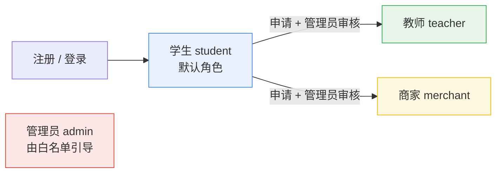
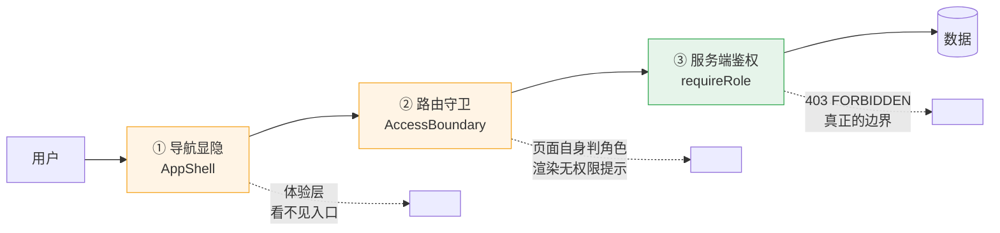
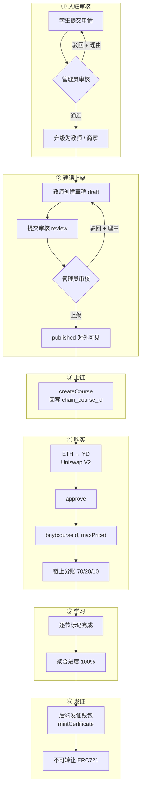

<div align="center">

# YD University

**中心化教务系统 + 链上支付与证书的全栈 DApp**

课程内容、审核流转、学习进度走传统后端；付费、分账、结业证书走 Ethereum Sepolia。

[](https://sepolia.etherscan.io)
[](https://nodejs.org)
[](https://hardhat.org)
[](#)

</div>

---

## 目录

| | |
| --- | --- |
| [一、这个项目在做什么](#一这个项目在做什么) | 链上链下分界 · 技术栈 |
| [二、快速开始](#二快速开始) | 三条命令跑起来 |
| [三、角色与权限](#三角色与权限) | 四个角色 · 能力矩阵 · 三道防线 |
| [四、完整业务流程](#四完整业务流程) | 从注册到发证的六个阶段 |
| [五、链上合约](#五链上合约) | 五个合约 · 部署地址 · 分账规则 |
| [六、认证体系](#六认证体系) | demo 模式 · Privy 模式 |
| [七、本地开发](#七本地开发) | mock 与 PostgreSQL 两种数据源 |
| [八、Sepolia 部署](#八sepolia-部署) | 部署 · 回填 · 链上验收 |
| [九、自动发证配置](#九自动发证配置) | 独立发证钱包 |
| [十、环境变量总表](#十环境变量总表) | 前端 · 后端 · 合约 |
| [十一、安全边界](#十一安全边界) | 密钥处理原则 |
| [十二、课程来源与版权](#十二课程来源与版权) | 演示数据说明 |

---

## 一、这个项目在做什么

学生用 **YD 代币**购买课程，链上合约自动把收入按 **70/20/10** 分给教师、商家和平台；
学完全部章节后，平台为学生钱包铸造一张**不可转让**的 ERC721 结业证书。

教务侧（课程内容、教师审核、课程上架、学习进度）是传统的中心化后端——
链上存视频和进度既贵又没必要，真正需要可验证的只有**钱和凭证**。

### 链上 / 链下分界

<table>
<tr><th width="50%">🔗 链上（Sepolia）</th><th width="50%">🗄 链下（PostgreSQL / 内存）</th></tr>
<tr valign="top"><td>

- YD 余额、授权额度、转账
- 课程 ID、教师/商家钱包、价格、分账比例
- 购买关系与实付价格
- 三方可提现收益
- 结业证书 token、课程 ID、学生钱包

</td><td>

- 用户身份、角色、主钱包
- 教师/商家申请与审核留痕
- 课程正文、章节、封面、评论
- 每节课完成状态与聚合进度
- 链上事件索引副本与同步游标

</td></tr>
</table>

### 技术栈

| 层 | 选型 |
| --- | --- |
| **合约** | Solidity 0.8.28 · OpenZeppelin 5 · Hardhat 3 + Ignition · viem |
| **后端** | Node ≥22 · Fastify 5 · Zod 4 · postgres.js · jose（JWT 校验） |
| **前端** | React 19 · Vite 8 · react-router-dom · viem · Privy |
| **链** | Ethereum Sepolia（chainId `11155111`）· Uniswap V2（ETH↔YD 兑换） |
| **工程** | npm workspaces · TypeScript · oxlint · node:test |

---

## 二、快速开始

```bash
npm install
npm run dev:api    # → http://localhost:3001
```

另开一个终端：

```bash
npm run dev:web    # → http://localhost:5173
```

**默认配置不需要数据库、不需要钱包、不需要任何外部服务**——
`AUTH_MODE=demo` + `COURSE_DATA_SOURCE=mock`，四个演示账号和三门课程都在内存里，
顶栏可以直接切换身份。

跑一遍完整检查：

```bash
npm test && npm run typecheck && npm run lint && npm run build
```

---

## 三、角色与权限

### 3.1 四个角色



| 角色 | 来源 | 一句话职责 |
| :--- | :--- | :--- |
| 🎓 **学生** `student` | 注册后的默认角色 | 浏览、购买、学习课程，可申请成为教师或商家 |
| 👨‍🏫 **教师** `teacher` | 学生申请 + 管理员审核 | 创建课程、提交审核、提取 **70%** 分账 |
| 🏪 **商家** `merchant` | 学生申请 + 管理员审核 | 查看参与分账的课程、提取 **20%** 分账 |
| 🛡 **管理员** `admin` | `BOOTSTRAP_ADMIN_SUBJECTS` / `BOOTSTRAP_ADMIN_WALLETS` 白名单 | 审核入驻申请与课程上架 |

> [!IMPORTANT]
> **角色只认数据库里的 `users.role`。** 请求头、请求体里任何角色声明一律忽略——
> `requireUser` 每次都会回库读角色，前端传什么都不影响鉴权结果。

### 3.2 能力矩阵

定义在 [`apps/web/src/auth/permissions.ts`](apps/web/src/auth/permissions.ts)：

| 能力 | 学生 | 教师 | 商家 | 管理员 |
| :--- | :---: | :---: | :---: | :---: |
| `learn` 学习课程 | ✅ | ✅ | ✅ | — |
| `purchase` 购买课程 | ✅ | ✅ | ✅ | — |
| `applyCreator` 申请入驻 | ✅ | — | — | — |
| `manageCourses` 管理课程 | — | ✅ | — | — |
| `manageMerchantRevenue` 商家分账 | — | — | ✅ | — |
| `reviewPlatform` 平台审核 | — | — | — | ✅ |

> [!NOTE]
> **管理员不能购买也不能学习课程。** 这是刻意的职责隔离——审核者不应该同时是消费者。
> 合约层面不做这个限制（链上只认钱包地址和购买状态），约束落在应用层。

### 3.3 三道防线

权限**不是靠隐藏导航实现的**。直接敲 URL 进受限页面，会被后两道拦下：



### 3.4 页面路由权限

定义在 [`apps/web/src/App.tsx`](apps/web/src/App.tsx)：

| 路由 | 页面 | 允许角色 |
| :--- | :--- | :--- |
| `/` | 首页 / 课程市场 | 🌐 公开（含游客） |
| `/login` | 登录 | 🌐 公开 |
| `/courses/:slug` | 课程详情与购买 | 🌐 公开（购买需登录） |
| `/learn/:slug` | 学习工作台 | 学生 · 教师 · 商家 |
| `/swap` | ETH → YD 兑换 | 学生 · 教师 · 商家 |
| `/creator` | 创作者中心 / 教学中心 / 商家中心 | 学生 · 教师 · 商家 |
| `/profile` | 个人中心 | 全部已登录角色 |
| `/admin` | 管理后台 | 仅管理员 |

`/creator` 一个路由三副面孔：学生看到**入驻申请表单**，教师看到**教学中心**，商家看到**商家中心**。

### 3.5 API 端点权限

| 方法 | 端点 | 守卫 |
| :--- | :--- | :--- |
| `GET` | `/health` | 🌐 公开 |
| `GET` | `/api/courses` · `/api/courses/:slug` | 🌐 公开（**只返回 `status='published'`**） |
| `GET` | `/api/me` | `requireUser` |
| `GET` | `/api/creators/applications/mine` | `requireUser` |
| `POST` | `/api/creators/applications` | `requireRole("student")` |
| `GET` | `/api/teacher/merchants` · `/api/teacher/courses` | `requireRole("teacher")` |
| `POST` | `/api/teacher/courses` · `/api/teacher/courses/:id/submit` | `requireRole("teacher")` |
| `GET` | `/api/merchant/courses` | `requireRole("merchant")` |
| `GET` | `/api/admin/creators` · `/api/admin/courses` | `requireRole("admin")` |
| `POST` | `/api/admin/creators/:id/approve` · `/reject` | `requireRole("admin")` |
| `POST` | `/api/admin/courses/:id/publish` · `/reject` | `requireRole("admin")` |
| `GET` | `/api/learning/courses/:slug/progress` | `requireRole("student","teacher","merchant")` |
| `POST` `DELETE` | `/api/learning/courses/:slug/sections/:id/complete` | `requireRole("student","teacher","merchant")` |

**未上架课程不泄露存在性**——访问详情统一返回 `404`，而不是 `403`。

完整字段与错误码见 [`docs/api-contract.md`](docs/api-contract.md)。

---

## 四、完整业务流程



### 阶段详解

<details open>
<summary><b>① 入驻审核</b> — 学生 → 教师 / 商家</summary>

<br>

学生提交申请后在 `creators` 建一行 `review_status='pending'`。管理员通过则写入 `verified_at`
（数据库 CHECK 约束保证 `approved` 与 `verified_at` 一致），驳回则**必须填写 `rejection_reason`**。

驳回后学生可以用同一接口重新提交——`(user_id, role)` 上有部分唯一索引兜底，
同一用户同一角色始终只有一条申请，重复提交返回 `409`。

**未通过审核的账号不能开课。**

</details>

<details open>
<summary><b>② 建课上架</b> — draft → review → published</summary>

<br>

| 状态 | 含义 | 谁可见 |
| :--- | :--- | :--- |
| `draft` | 草稿 | 只有教师自己 |
| `review` | 待审核，记录 `submitted_at` | 教师 + 管理员 |
| `published` | 已上架，写入 `reviewed_by` + `reviewed_at` | 所有人 |
| `archived` | 已下架 | 教师 + 管理员 |

教师新建课程时**必须选择一个已审核商家**作为 20% 分账方，后端会再次校验商家资质。
`reviewed_by` 与 `reviewed_at` 由 CHECK 约束强制同时写入，不会出现"上架了但不知道谁批的"。

</details>

<details open>
<summary><b>③ 上链</b> — 只有已上架课程能上链</summary>

<br>

管理员上架后调用 `CourseRegistry.createCourse`，把链上 `courseId` 回写到 `courses.chain_course_id`。
**没有 `chain_course_id` 的课程无法购买**——前端按钮显示"课程尚未上链"。

> [!WARNING]
> 目前上架动作只改数据库 `status`，**不会自动调用 `createCourse`**。
> 三门演示课程的链上 ID（1/2/3）是用脚本手工创建的。

</details>

<details open>
<summary><b>④ 购买</b> — 两步授权 + 自动分账</summary>

<br>

ERC20 的经典两步：

```
① approve(CourseMarket, priceYD)   ② buy(courseId, maxPrice)
```

每一步都先查链上真实状态，所以中途失败后再点一次会**从断点继续**，不会重复交易。

**YD 不够怎么办？** 课程详情页会把按钮换成「YD 不足，去兑换」，跳到 `/swap`，
走 Uniswap V2 的 `swapETHForExactTokens` 用 ETH 精确换出指定数量的 YD，多付的 ETH 由 router 退回。
兑换成功后自动跳回课程页，顶栏余额同步刷新。

**分账在 `buy` 里一次完成**，采用 pull-payment 模式记账到 `pendingWithdrawals`，
三方各自调 `withdraw()` 提取——避免任何一方的接收失败阻塞购买。

| 分成方 | 比例 | 4 YD 课程 |
| :--- | ---: | ---: |
| 教师 | 70% | 2.8 YD |
| 商家 | 20% | 0.8 YD |
| 平台 | 10% | 0.4 YD |

`maxPrice` 参数防止价格在交易上链前被改高。

</details>

<details open>
<summary><b>⑤ 学习</b> — 逐节完成，聚合进度</summary>

<br>

学生逐节点击完成，`lesson_progress` 记录 `completed_at`。取消完成只清 `completed_at`，
**`created_at` 保留**，据此还原首次完成时间。

聚合进度 `percent` 向下取整，**所有小节都完成**才算 `completed = true`。

「我的学习」入口是否展示，判断依据是**链上 `CourseMarket.hasPurchased`**，
不是后端数据——因为后端还没有同步 `CoursePurchased` 事件的索引器。

</details>

<details open>
<summary><b>⑥ 发证</b> — 后端代发，不可转让</summary>

<br>

进度达 100% 时，学习接口异步触发一次发证扫描（不阻塞响应）；
同时有定时兜底扫描，让上一轮失败的发证在下一轮自动重试。

**幂等由两层保证：**

1. 扫描时先读链上 `certificateOf`，已有证书直接跳过
2. 真发出去时合约的 `CertificateAlreadyMinted` 再挡一次

所以重复触发、并发触发、进程重启重放都不会重复铸造。

证书是 **ERC721 兼容但不可转让**的——`_update` 钩子拒绝任何 `from` 和 `to` 都非零的转移，
只允许铸造和销毁。管理员可以带公开理由撤销。

> [!NOTE]
> 曾评估过 **Chainlink CRE** 做去信任化发证，因需要 Early Access 审批、
> 且 onchain registry 要消耗以太坊主网 gas 而改为后端代发。
> `CompletionReceiver` 合约已部署但当前未接入。

</details>

---

## 五、链上合约

### 5.1 五个合约的职责

| 合约 | 职责 | 关键安全边界 |
| :--- | :--- | :--- |
| **`YDToken`** | 固定发行 10 万 YD | **没有 mint 入口**，部署时一次性铸给国库 |
| **`CourseRegistry`** | 课程价格、教师/商家钱包、分账比例、上架状态 | AccessControl · 比例合计必须 `10000` bps |
| **`CourseMarket`** | `approve + buy`、购买关系、分账记账、提现 | SafeERC20 · ReentrancyGuard · `maxPrice` · 防重复购买 |
| **`CourseCertificate`** | 不可转让结业证书 | 校验链上已购买 · 每课每钱包一张 · 阻断转账 |
| **`CompletionReceiver`** | 完成报告入口（**当前未接入**） | forwarder 白名单 · `completionId` 防重放 |

### 5.2 Sepolia 部署地址

| 合约 | 地址 |
| :--- | :--- |
| `YDToken` | [`0x0c82de3EaD02d213111bA42a6B92F0573a7c3761`](https://sepolia.etherscan.io/address/0x0c82de3EaD02d213111bA42a6B92F0573a7c3761) |
| `CourseRegistry` | [`0x2360EE174B735c44ebb64DBF84ee1c91965b1789`](https://sepolia.etherscan.io/address/0x2360EE174B735c44ebb64DBF84ee1c91965b1789) |
| `CourseMarket` | [`0x241257305de4BB401E20E3E482ebABBD12Dc433b`](https://sepolia.etherscan.io/address/0x241257305de4BB401E20E3E482ebABBD12Dc433b) |
| `CourseCertificate` | [`0x55047EFDd91Ab440CA9eac5bFb91F2C98A25C150`](https://sepolia.etherscan.io/address/0x55047EFDd91Ab440CA9eac5bFb91F2C98A25C150) |
| `CompletionReceiver` | [`0xFc586Bcf337d0528d5E563F1a4890eB61c622D3d`](https://sepolia.etherscan.io/address/0xFc586Bcf337d0528d5E563F1a4890eB61c622D3d) |

### 5.3 部署参数

`contracts/ignition/parameters.sepolia.json`，全部是**可公开的地址**：

| 参数 | 用途 |
| :--- | :--- |
| `admin` | 各合约 AccessControl 的 admin |
| `platformTreasury` | 平台 10% 收款地址 |
| `creForwarder` | `CompletionReceiver` 的 forwarder（当前未接入，无实际作用） |
| `defaultTeacher` / `defaultMerchant` | 演示教师 / 商家钱包，供建课脚本取用 |

> [!IMPORTANT]
> Sepolia 部署时 `SEPOLIA_PRIVATE_KEY` 对应的钱包**必须就是 `admin`**，
> 否则 `CourseCertificate.grantRole` 授权交易无法签名。

---

## 六、认证体系

认证做成**可替换的一层**，业务代码只依赖接口（`apps/api/src/auth/`）：

```
Authorization: Bearer <token>
  → AuthVerifier.verify(token, identityToken, activeWallet)
  → UserRepository.findByPrivyUserId(subject) → users 行
  → request.currentUser
  → requireRole(...) 比对 users.role
```

### 6.1 demo 模式（默认，仅限本地）

令牌形如 `demo:<privy_user_id>`，**不校验签名**。mock 数据源预置四个账号：

| 身份 | Authorization 头 | 角色 | 备注 |
| :--- | :--- | :--- | :--- |
| 学生 | `Bearer demo:demo-student` | `student` | 无钱包 |
| 教师 | `Bearer demo:demo-teacher` | `teacher` | 已审核，持有 3 门课程 |
| 商家 | `Bearer demo:demo-merchant` | `merchant` | 已审核，可查看分账课程 |
| 管理员 | `Bearer demo:demo-admin` | `admin` | 无钱包 |

前端未配置 `VITE_PRIVY_APP_ID` 时自动进入演示登录，顶栏出现身份下拉，切换即换令牌重拉 `/api/me`。

### 6.2 Privy 模式（真实登录）

四种登录方式全部开启：**邮箱 / Google / GitHub / 钱包**。
令牌校验走 Privy 公开 JWKS（ES256），**只需要 App ID，不需要 App Secret**。

```bash
# apps/web/.env
VITE_PRIVY_APP_ID=<你的 App ID>

# apps/api/.env
AUTH_MODE=privy
PRIVY_APP_ID=<同一个 App ID>
```

> [!WARNING]
> **前后端必须同时切换。** 否则前端发真实 JWT 而后端只认 `demo:` 前缀，会全站 401。

**要按钱包识别用户**（发证、分账、已购课程判定都依赖主钱包），必须在 Privy 控制台
**User management → Authentication → Advanced** 打开 **`Return user data in an identity token`**。
没有 identity token 时钱包地址取不到，`users.primary_wallet` 会一直是空。

**引导第一个管理员**：把 `/api/me` 返回的 `did:privy:xxx` 填进 `apps/api/.env`：

```bash
BOOTSTRAP_ADMIN_SUBJECTS=did:privy:xxx
# 或按钱包
BOOTSTRAP_ADMIN_WALLETS=0x...
# 测试用固定角色映射
WALLET_ROLE_MAPPINGS=0x...=teacher,0x...=merchant
```

白名单**只在服务端生效**。同一 Privy 会话切换 MetaMask 账号时，当前钱包必须出现在
**签名有效的** identity token 中才会被采用，离开映射钱包后不残留管理员权限。

---

## 七、本地开发

### 7.1 mock 数据源（默认）

数据全在**进程内存**里，重启 API 即回到初始状态——包括学习进度。

<details>
<summary><b>curl 走一遍：学生 → 教师 → 建课 → 上架</b></summary>

<br>

```bash
API=http://localhost:3001

# 1. 学生看自己的身份：role=student，creator=null
curl -s $API/api/me -H "Authorization: Bearer demo:demo-student"

# 2. 学生申请成为教师
curl -s -X POST $API/api/creators/applications \
  -H "Authorization: Bearer demo:demo-student" \
  -H "Content-Type: application/json" \
  -d '{"role":"teacher","displayName":"张老师","walletAddress":"0x1111111111111111111111111111111111111111"}'

# 3. 管理员取出待审申请 id
CID=$(curl -s "$API/api/admin/creators?status=pending" \
  -H "Authorization: Bearer demo:demo-admin" | jq -r '.data[0].id')

# 4. 管理员通过（驳回用 /reject 并带 {"reason":"资料不全"}）
curl -s -X POST $API/api/admin/creators/$CID/approve -H "Authorization: Bearer demo:demo-admin"

# 5. 角色已升为 teacher
curl -s $API/api/me -H "Authorization: Bearer demo:demo-student" | jq '.data.role'

# 6. 建课草稿（priceYD 必须是大于 0 的整数字符串）
COURSE=$(curl -s -X POST $API/api/teacher/courses \
  -H "Authorization: Bearer demo:demo-student" \
  -H "Content-Type: application/json" \
  -d '{"slug":"my-first-course","title":"我的第一门课","summary":"演示课程","category":"Solidity","level":"入门","priceYD":"4"}' \
  | jq -r '.data.id')

# 7. 提交审核：draft → review
curl -s -X POST $API/api/teacher/courses/$COURSE/submit -H "Authorization: Bearer demo:demo-student"

# 8. 管理员上架
curl -s -X POST $API/api/admin/courses/$COURSE/publish -H "Authorization: Bearer demo:demo-admin"

# 9. 公开列表里出现这门课
curl -s $API/api/courses | jq '.data[].slug'
```

边界验证：

```bash
curl -s $API/api/me                                                    # 401 UNAUTHENTICATED
curl -s $API/api/admin/creators -H "Authorization: Bearer demo:demo-merchant"  # 403 FORBIDDEN
# 同一用户同一 role 重复申请 → 409
```

</details>

<details>
<summary><b>页面上走一遍</b></summary>

<br>

1. 选 **demo-student** → 顶栏「创作者中心」→ 填申请身份、显示名、收款钱包 → 提交
2. 切到 **demo-admin** → 「管理后台」→「待审教师 / 商家」→ 点「通过」（驳回需填理由）
3. 切回 **demo-student** → 创作者中心已变成教学中心 → 「新建课程草稿」→ 「提交审核」
4. 切到 **demo-admin** → 「待上架课程」→ 点「上架」
5. 回首页，这门课出现在课程列表里

</details>

### 7.2 PostgreSQL 数据源

```bash
docker compose up -d postgres

psql "$DATABASE_URL" -v ON_ERROR_STOP=1 -f apps/api/migrations/001_initial.sql
psql "$DATABASE_URL" -v ON_ERROR_STOP=1 -f apps/api/migrations/002_review_workflow.sql
psql "$DATABASE_URL" -v ON_ERROR_STOP=1 -f apps/api/migrations/003_creator_identity.sql
```

| Migration | 内容 |
| :--- | :--- |
| `001_initial.sql` | 基线表：users / creators / courses / sections / purchases / lesson_progress / certificates |
| `002_review_workflow.sql` | 角色枚举 + 教师与课程审核字段 |
| `003_creator_identity.sql` | `creators.user_id` + 「同一用户同一 role 只留一条申请」部分唯一索引 |

然后在 `apps/api/.env` 设 `COURSE_DATA_SOURCE=postgres` 和 `DATABASE_URL`。

> [!CAUTION]
> **`003` 必须执行**，否则 `creators` 没有 `user_id`，创作者申请与 `/api/me` 的申请回显都跑不起来。
> migration **不带任何种子数据**——postgres 模式下要用 demo 令牌，得自己在 `users` 里插行。

---

## 八、Sepolia 部署

### 1️⃣ 配置凭证

仓库不含任何私钥。在本地私有 `.env` 或 Hardhat keystore 中配置：

```
SEPOLIA_RPC_URL  ·  SEPOLIA_PRIVATE_KEY  ·  ETHERSCAN_API_KEY
```

### 2️⃣ 部署

```bash
npm run deploy:local -w @yd/contracts     # 本地网络，用模块内默认地址
npm run deploy:sepolia -w @yd/contracts   # Sepolia，读参数文件
```

带 Etherscan 验证：

```bash
npx hardhat ignition deploy --network sepolia \
  --parameters ignition/parameters.sepolia.json \
  --verify ignition/modules/YDUniversity.ts
```

### 3️⃣ 回填前端地址

```bash
# apps/web/.env.local
VITE_CHAIN_ID=11155111
VITE_YD_TOKEN_ADDRESS=...
VITE_COURSE_REGISTRY_ADDRESS=...
VITE_COURSE_MARKET_ADDRESS=...
VITE_COURSE_CERTIFICATE_ADDRESS=...
VITE_UNISWAP_ROUTER_ADDRESS=...
VITE_WETH_ADDRESS=...
```

### 4️⃣ 链上脚本

| 命令 | 作用 |
| :--- | :--- |
| `npm run chain:verify -w @yd/contracts` | 核对地址、角色、合约互相引用是否一致 |
| `npm run chain:create-course -w @yd/contracts` | 创建 / 复用演示课程（4 YD，70/20/10） |
| `npm run chain:smoke -w @yd/contracts` | 走一遍 approve → buy → 铸证书 |
| `npm run chain:add-liquidity -w @yd/contracts` | 向 Uniswap V2 注入 YD/ETH 流动性 |
| `npm run chain:grant-minter -w @yd/contracts` | 把 `MINTER_ROLE` 授予后端发证钱包 |

---

## 九、自动发证配置

后端用**独立发证钱包**调用 `CourseCertificate.mintCertificate`。

> [!CAUTION]
> **绝不要复用管理员私钥。** 管理员钱包持有全部 YD 供应、Uniswap LP 份额，
> 以及所有合约的 `DEFAULT_ADMIN_ROLE`——后端一旦被打穿就全丢了。
> 独立钱包只授 `MINTER_ROLE`，攻击者最多能给已购课的地址补发证书。

### 配置步骤

```bash
# 1. 生成一个全新钱包，转入少量 Sepolia ETH 作为 gas

# 2. 授予 MINTER_ROLE（需要 admin 签名）
CERTIFICATE_ISSUER_ADDRESS=0x... npm run chain:grant-minter -w @yd/contracts

# 3. 配置 apps/api/.env
CERTIFICATE_ISSUANCE=on
SEPOLIA_RPC_URL=https://ethereum-sepolia-rpc.publicnode.com
COURSE_CERTIFICATE_ADDRESS=0x55047EFDd91Ab440CA9eac5bFb91F2C98A25C150
CERTIFICATE_ISSUER_PRIVATE_KEY=0x...
CERTIFICATE_SWEEP_INTERVAL_MS=300000
```

`CERTIFICATE_ISSUANCE` 默认 `off`。打开但配置不全时**启动即失败**，不会带着半套配置跑起来。
启动日志只打印发证钱包**地址**，私钥任何时候都不进日志。

### 发证的三个前提

| 前提 | 不满足会怎样 |
| :--- | :--- |
| 学员已绑定 `primary_wallet` | 完成记录不进待发证列表，**静默无事发生** |
| 课程已上链（有 `chain_course_id`） | 同上 |
| 该钱包**已在链上购买**该课程 | 合约 `CourseNotPurchased` revert |

---

## 十、环境变量总表

<details>
<summary><b>apps/api/.env</b></summary>

<br>

| 变量 | 默认 | 说明 |
| :--- | :--- | :--- |
| `PORT` | `3001` | 监听端口 |
| `HOST` | `127.0.0.1` | 监听地址 |
| `COURSE_DATA_SOURCE` | `mock` | `mock` \| `postgres` |
| `DATABASE_URL` | — | `postgres` 模式必填 |
| `AUTH_MODE` | `demo` | `demo` \| `privy` |
| `PRIVY_APP_ID` | — | `privy` 模式必填 |
| `BOOTSTRAP_ADMIN_SUBJECTS` | 空 | 逗号分隔的 privy DID 白名单 |
| `BOOTSTRAP_ADMIN_WALLETS` | 空 | 逗号分隔的钱包白名单 |
| `WALLET_ROLE_MAPPINGS` | 空 | `0x...=teacher,0x...=merchant` |
| `CERTIFICATE_ISSUANCE` | `off` | `off` \| `on` |
| `SEPOLIA_RPC_URL` | — | 发证开启时必填 |
| `COURSE_CERTIFICATE_ADDRESS` | — | 发证开启时必填 |
| `CERTIFICATE_ISSUER_PRIVATE_KEY` | — | 发证开启时必填，**不进仓库** |
| `CERTIFICATE_SWEEP_INTERVAL_MS` | `300000` | 失败重试扫描间隔 |

</details>

<details>
<summary><b>apps/web/.env.local</b></summary>

<br>

| 变量 | 说明 |
| :--- | :--- |
| `VITE_API_BASE_URL` | API 地址 |
| `VITE_PRIVY_APP_ID` | 留空或占位符时回退到演示登录 |
| `VITE_DEMO_USER_IDS` | 演示身份下拉选项 |
| `VITE_CHAIN_ID` | `11155111` |
| `VITE_YD_TOKEN_ADDRESS` 等 | 五个合约地址 |
| `VITE_UNISWAP_ROUTER_ADDRESS` · `VITE_WETH_ADDRESS` | 兑换功能所需 |

</details>

<details>
<summary><b>contracts（Hardhat keystore 或 .env）</b></summary>

<br>

| 变量 | 说明 |
| :--- | :--- |
| `SEPOLIA_RPC_URL` | 部署用 RPC |
| `SEPOLIA_PRIVATE_KEY` | **必须是 `admin` 钱包**，建议放 keystore 而非明文 |
| `ETHERSCAN_API_KEY` | 合约验证 |

</details>

---

## 十一、安全边界

> [!CAUTION]
> **仓库不含任何私钥。** 所有敏感值只以尖括号占位符出现在 `.env.example`，
> 真实值放本地私有 `.env` 或 Hardhat keystore——不进仓库、不进提交、不进文档。

| 原则 | 落地 |
| :--- | :--- |
| **角色不可伪造** | 只认 `users.role`，每次请求回库读取 |
| **未上架不泄露** | 详情返回 `404` 而非 `403` |
| **审核留痕强制** | CHECK 约束保证 `reviewed_by` 与 `reviewed_at` 同时写入，驳回必填理由 |
| **分账防阻塞** | pull-payment，任一方提现失败不影响他人和后续购买 |
| **价格防抢跑** | `buy(courseId, maxPrice)` |
| **重入防护** | `ReentrancyGuard` + SafeERC20 |
| **证书不可转让** | `_update` 拒绝双非零地址转移 |
| **发证权最小化** | 独立钱包只授 `MINTER_ROLE`，不给 admin 权限、不放 YD |
| **私钥不落日志** | 校验只验形状，报错不含值；启动日志只打地址 |

### 已知限制

- **后端不校验购买**：学习进度接口目前只校验角色，未校验链上购买状态，购买门禁是前端行为
- **无事件索引器**：`CoursePurchased` 事件没有同步到数据库，已购判定每次都读链
- **课程上链未自动化**：管理员上架不会自动 `createCourse`
- **课程数据两份**：`apps/web/src/data/courses.ts` 与 API mock 数据并存，改 `chainCourseId` 要同时改

---

## 十二、课程来源与版权

三门演示课程来自公开免费平台 **[Cyfrin Updraft](https://updraft.cyfrin.io)**：

| 课程 | 讲师 | 小节 | 原课程 |
| :--- | :--- | ---: | :--- |
| Solidity 智能合约开发从入门到实战 | Patrick Collins | 15 | [链接](https://updraft.cyfrin.io/courses/solidity) |
| DeFi 核心原理与协议拆解（Uniswap V2 源码精讲） | Tasuku Nakamura | 14 | [链接](https://updraft.cyfrin.io/courses/uniswap-v2) |
| 智能合约安全：从攻击到防御 | Patrick Collins | 9 | [链接](https://updraft.cyfrin.io/courses/security) |

仓库**只保存标题、简介、小节标题与课程级来源链接**，不转存视频或讲义正文；
章节仅用于记录完成状态，不跳转外部页面。

> [!WARNING]
> **这些只是演示数据，版权归原作者与 Cyfrin Updraft 所有。**
> 价格（4 YD）、评分、学习人数为演示用虚构值，与原课程无关；原课程本身免费。
> 用于演示以外的场景请先取得授权，或换成自有课程数据。

---

## 目录结构

```
yd-university/
├── apps/
│   ├── api/                    Fastify API
│   │   ├── src/auth/           可替换的认证层（demo / Privy）
│   │   ├── src/chain/          后端发证（发证钱包 + 扫描重试）
│   │   ├── src/domain/         领域模型
│   │   ├── src/repositories/   仓储：每个都有 mock + postgres 两套实现
│   │   ├── src/routes/         路由与鉴权
│   │   └── migrations/         001 ~ 003
│   └── web/                    React + Vite
│       ├── src/auth/           角色能力矩阵与路由守卫
│       ├── src/pages/          首页 / 课程 / 学习 / 兑换 / 创作者 / 管理后台
│       └── src/web3/           合约读写、余额、兑换、已购判定
├── contracts/                  Solidity + Hardhat 3 + Ignition
│   ├── contracts/              5 个合约
│   ├── ignition/               部署模块与参数
│   └── scripts/                链上验收与运维脚本
└── docs/                       需求基线 · 架构 · API 契约
```

## 推荐阅读顺序

1. [`docs/requirements.md`](docs/requirements.md) —— 冻结规则、审核流、哪些数据上链
2. `npm run contracts:test` —— 观察 `approve → buy → pendingWithdrawals`
3. 启动 API，访问 `/health`、`/api/courses`
4. 启动前端，跑一遍「本地跑通审核流」，再看课程详情的两步购买状态机
5. 最后再部署 Sepolia、接 Privy、注入流动性、打开自动发证
