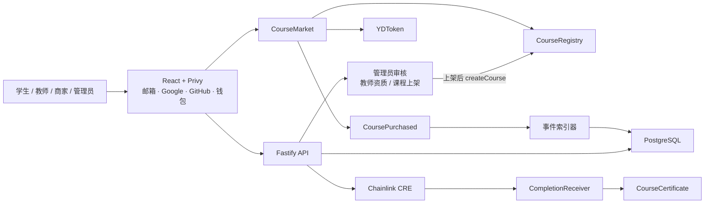

# 架构设计



## 合约职责

| 合约 | 职责 | 关键安全边界 |
| --- | --- | --- |
| `YDToken` | 固定发行 10 万枚 YD | 没有 mint 入口 |
| `CourseRegistry` | 课程价格、角色、分账和上架状态 | AccessControl、价格事件、比例合计 10000 bps |
| `CourseMarket` | `approve + buy`、购买关系、分账记账、提现 | SafeERC20、ReentrancyGuard、maxPrice、防重复购买 |
| `CourseCertificate` | 不可转让课程证书 | 购买校验、每课每钱包一张、转账阻断 |
| `CompletionReceiver` | 接收 CRE 完成报告 | forwarder 白名单、completionId 防重放 |

## 角色与审核状态机

角色存在 `users.role`，枚举 `user_role('student','teacher','merchant','admin')`，新用户默认 `student`。
教师资质与课程上架都由管理员人工审核，两条链路各自留痕：

| 对象 | 状态字段 | 取值 | 留痕字段 |
| --- | --- | --- | --- |
| 教师资质 `creators` | `review_status` | `pending` / `approved` / `rejected` | `reviewed_by`、`reviewed_at`、`rejection_reason` |
| 课程 `courses` | `status` | `draft` / `review` / `published` / `archived` | `submitted_at`、`reviewed_by`、`reviewed_at`、`rejection_reason` |

数据库层用 CHECK 约束把规则钉死，不依赖应用代码自觉：

- `creators_approved_verified`：`review_status = 'approved'` 与 `verified_at IS NOT NULL` 必须同真同假。
- `creators_rejected_reason`：驳回必须带非空 `rejection_reason`。
- `courses_published_reviewed`：`status = 'published'` 必须同时有 `reviewed_by` 与 `reviewed_at`，即上架必经审核。

待审队列走两个 partial index：`creators_review_pending_idx`、`courses_review_queue_idx`。
读取侧的可见性由仓储统一兜底：`listPublished` 与 `findPublishedDetailBySlug` 都带 `WHERE status = 'published'`。

## 外部来源课程

演示课程的正文托管在第三方免费平台，库内只存元信息与外链：
`courses.course_url / provider_name / teacher_x_url`，`course_sections.external_url / provider`。
API 的 `CourseSummary` 用于列表，`CourseDetail` 额外带一份按 `position` 升序的 `sections`。
`courses.provider_x_url` 与 `course_sections.original_title` 两列尚未建，postgres 模式下这两个字段恒为 `null`。

## 课程 ID 映射

数据库先创建稳定的 UUID，课程通过管理员审核上架（`status = 'published'`）后才允许上链，上链后回绑：

```text
courses.id (UUID)
courses.chain_id (11155111)
courses.registry_address
courses.chain_course_id
courses.publish_tx_hash
```

## 资金流

购买时不连续向三个外部钱包转账，而是在一笔交易内完成确定性记账：

```text
学生支付 4 YD
→ CourseMarket 持有 4 YD
→ 教师 pending += 2.8
→ 商家 pending += 0.8
→ 平台 pending += 0.4
→ 每个收款方独立 withdraw
```

这种 pull-payment 方案降低了购买交易被某个异常收款地址阻塞的风险。
