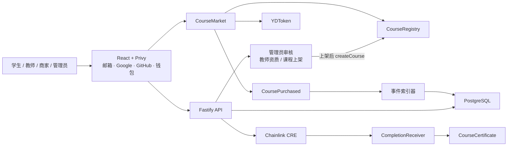

# 架构设计



## 合约职责

| 合约 | 职责 | 关键安全边界 |
| --- | --- | --- |
| `YDToken` | 固定发行 10 万枚 YD | 没有 mint 入口 |
| `CourseRegistry` | 课程价格、角色、分账和上架状态 | AccessControl、价格事件、比例合计 10000 bps |
| `CourseMarket` | `approve + buy`、购买关系、分账记账、提现 | SafeERC20、ReentrancyGuard、maxPrice、防重复购买 |
| `CourseCertificate` | 不可转让课程证书 | 购买校验、每课每钱包一张、转账阻断 |
| `CompletionReceiver` | 接收 CRE 完成报告 | forwarder 白名单、completionId 防重放 |

## 认证与鉴权分层

Privy App ID 未到位，所以认证做成可替换的一层，业务代码只依赖接口（`apps/api/src/auth/`）：

```text
Authorization: Bearer <token>
  → AuthVerifier.verify(token) → { subject, email?, wallet? } | null
  → UserRepository.findByPrivyUserId(subject) → users 行
  → request.currentUser（Fastify 模块增强声明的字段）
  → requireRole(...) 比对 users.role
```

| 组件 | 职责 |
| --- | --- |
| `AuthVerifier` | 只做「token → subject」，不碰数据库、不碰角色 |
| `DemoAuthVerifier`（`AUTH_MODE=demo`，默认） | token 形如 `demo:<privy_user_id>`，取出 subject，不校验签名，仅限本地 |
| `PrivyAuthVerifier`（`AUTH_MODE=privy`） | 构造时强制 `PRIVY_APP_ID` / `PRIVY_APP_SECRET`；令牌校验尚未接线，`verify()` 抛 `NOT_IMPLEMENTED` |
| `createAuthVerifier(env)` | 按 `AUTH_MODE` 选实现，凭证缺失时启动即失败，不静默降级成 demo |
| `createAuthGuards(verifier, users)` | 产出 `requireUser`（401 `UNAUTHENTICATED`）与 `requireRole(...roles)`（403 `FORBIDDEN`） |

关键边界：**角色只从数据库 `users.role` 读**。verifier 交出的只有 subject，请求头与请求体里的任何角色字段都不参与判权；
`creators` 里的 `role` 只表示「申请成为哪种创作者」，必须管理员通过后才在同一事务里传导到 `users.role`。
换 verifier 不影响这条链路——`AUTH_MODE=privy` 接线时只替换第一步。

## API 分层与仓储结构

`buildApp()` 只做装配：`Repositories` 与 `AuthVerifier` 都从外部注入，测试直接塞 mock 实现，不起数据库。

```text
routes/        HTTP 形状：zod 校验入参 → 调仓储 → presenters 出参
  me.ts  creators.ts  admin-creators.ts  admin-courses.ts  teacher-courses.ts  courses.ts
  schemas.ts     公共 zod 片段（uuid params、reason、钱包地址、http 链接）
  presenters.ts  对外视图（创作者申请只下发契约七字段，审核人等内部字段不出网）
auth/          verifier.ts（可插拔校验）+ guards.ts（requireUser / requireRole）
http/errors.ts fail() / failValidation()，统一 { error, message }
repositories/  接口 + mock 实现 + postgres 实现，一个接口两套实现
domain/        course.ts / creator.ts / user.ts 纯类型
```

仓储按读写对象切成五个接口，路由只认接口不认实现：

| 接口 | 用途 |
| --- | --- |
| `CourseRepository` | 公开课程读取（`listPublished` / `findPublishedDetailBySlug`） |
| `UserRepository` | 按 `privy_user_id` 查用户（鉴权唯一的用户入口） |
| `CreatorRepository` | 创作者申请：提交、我的申请、按状态列表、通过、驳回 |
| `AdminCourseRepository` | 课程审核队列：按状态列表、上架、驳回 |
| `TeacherCourseRepository` | 教师自己的课程：列表、建草稿、提交审核 |

`createRepositories(env)` 按 `COURSE_DATA_SOURCE` 选实现：postgres 模式下五个仓储共用一个 `postgres()` 连接池；
mock 模式下五个仓储共用一个 `MockDataStore`（users / creators / courses 三张内存表），
所以审核流转在 mock 下也能真实互相影响。管理端与教师端共享的读 SQL 收在 `postgres-managed-course.ts`。

教师建课目前把 `courses.merchant_id` 也填成该教师的 `creators.id`（接口没有选商家这一步），
商家分账要等商家侧能力落地后再改。

唯一约束冲突不靠字符串匹配报错：postgres 侧按 `constraint_name` 分类，抛 `RepositoryConflictError`
（`DUPLICATE_APPLICATION` / `WALLET_TAKEN` / `DUPLICATE_SLUG`），`app.ts` 的错误处理统一映射成 409。
同一处还兜住两类形状：未知路由走 `setNotFoundHandler` 返回 404 `NOT_FOUND`，
框架自带的 4xx（JSON 解析失败、载荷过大）映射成 400 `INVALID_REQUEST`，不吞成 500。

## 角色与审核状态机

角色存在 `users.role`，枚举 `user_role('student','teacher','merchant','admin')`，新用户默认 `student`。
教师资质与课程上架都由管理员人工审核，两条链路各自留痕：

| 对象 | 状态字段 | 取值 | 留痕字段 |
| --- | --- | --- | --- |
| 教师资质 `creators` | `review_status` | `pending` / `approved` / `rejected` | `reviewed_by`、`reviewed_at`、`rejection_reason` |
| 课程 `courses` | `status` | `draft` / `review` / `published` / `archived` | `submitted_at`、`reviewed_by`、`reviewed_at`、`rejection_reason` |

数据库层用 CHECK 约束把规则钉死，不依赖应用代码自觉：

- `creators_approved_verified`：`review_status = 'approved'` 与 `verified_at IS NOT NULL` 必须同真同假。
- `creators_rejected_reason`：驳回必须带非空 `rejection_reason`。
- `courses_published_reviewed`：`status = 'published'` 必须同时有 `reviewed_by` 与 `reviewed_at`，即上架必经审核。

003 补上申请归属：`creators.user_id`（可空，兼容 001 时代没有归属的存量行）与部分唯一索引
`creators_user_role_uniq_idx (user_id, role) WHERE user_id IS NOT NULL`——同一用户同一 role 只留一条申请，
驳回后复用该行重置为 `pending`，不产生第二条历史。

待审队列走两个 partial index：`creators_review_pending_idx`、`courses_review_queue_idx`。
读取侧的可见性由仓储统一兜底：`listPublished` 与 `findPublishedDetailBySlug` 都带 `WHERE status = 'published'`。

## 外部来源课程

演示课程的正文托管在第三方免费平台，库内只存元信息与外链：
`courses.course_url / provider_name / teacher_x_url`，`course_sections.external_url / provider`。
API 的 `CourseSummary` 用于列表，`CourseDetail` 额外带一份按 `position` 升序的 `sections`。
`courses.provider_x_url` 与 `course_sections.original_title` 由 002 补齐，postgres 模式下正常读写；
教师新建课程时接口不收 `providerXUrl`，这类课程该字段为 `null`。

## 课程 ID 映射

数据库先创建稳定的 UUID，课程通过管理员审核上架（`status = 'published'`）后才允许上链，上链后回绑：

```text
courses.id (UUID)
courses.chain_id (11155111)
courses.registry_address
courses.chain_course_id
courses.publish_tx_hash
```

## 资金流

购买时不连续向三个外部钱包转账，而是在一笔交易内完成确定性记账：

```text
学生支付 4 YD
→ CourseMarket 持有 4 YD
→ 教师 pending += 2.8
→ 商家 pending += 0.8
→ 平台 pending += 0.4
→ 每个收款方独立 withdraw
```

这种 pull-payment 方案降低了购买交易被某个异常收款地址阻塞的风险。
