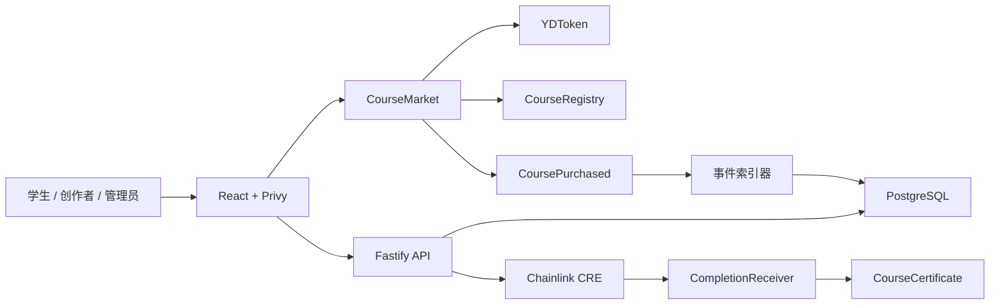

# 架构设计



## 合约职责

| 合约 | 职责 | 关键安全边界 |
| --- | --- | --- |
| `YDToken` | 固定发行 10 万枚 YD | 没有 mint 入口 |
| `CourseRegistry` | 课程价格、角色、分账和上架状态 | AccessControl、价格事件、比例合计 10000 bps |
| `CourseMarket` | `approve + buy`、购买关系、分账记账、提现 | SafeERC20、ReentrancyGuard、maxPrice、防重复购买 |
| `CourseCertificate` | 不可转让课程证书 | 购买校验、每课每钱包一张、转账阻断 |
| `CompletionReceiver` | 接收 CRE 完成报告 | forwarder 白名单、completionId 防重放 |

## 课程 ID 映射

数据库先创建稳定的 UUID，管理员审核上链后绑定：

```text
courses.id (UUID)
courses.chain_id (11155111)
courses.registry_address
courses.chain_course_id
courses.publish_tx_hash
```

## 资金流

购买时不连续向三个外部钱包转账，而是在一笔交易内完成确定性记账：

```text
学生支付 4 YD
→ CourseMarket 持有 4 YD
→ 教师 pending += 2.8
→ 商家 pending += 0.8
→ 平台 pending += 0.4
→ 每个收款方独立 withdraw
```

这种 pull-payment 方案降低了购买交易被某个异常收款地址阻塞的风险。
