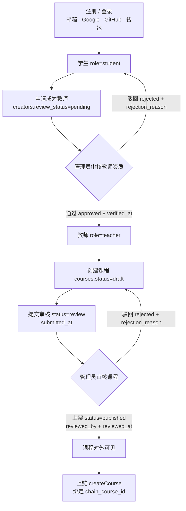

# YD University 需求基线 v0.2

## 已冻结规则

| 规则 | 决策 | 冻结版本 |
| --- | --- | --- |
| 网络 | Ethereum Sepolia，Chain ID `11155111` | v0.1 |
| YD 供应量 | 固定 `100,000 YD`，部署时一次性铸造 | v0.1 |
| 课程价格 | 默认 `4 YD`，课程管理员可修改 | v0.1 |
| 收益分配 | 教师 70%、商家 20%、平台 10% | v0.1 |
| 证书 | ERC721 兼容、不可转让、可由管理员说明原因后撤销 | v0.1 |
| 完成条件 | 所有课程小节完成，聚合进度达到 100% | v0.1 |
| 自动发证 | Chainlink CRE 把后端完成记录传给接收器后触发 mint | v0.1 |
| 登录方式 | 全部支持：邮箱、Google、GitHub、钱包（Privy `loginMethods`） | v0.2 |
| 角色 | 学生 / 教师 / 商家 / 管理员，四个角色全部保留，新用户默认学生 | v0.2 |
| 教师准入 | 教师必须由管理员审核通过后才能开课 | v0.2 |
| 课程上架 | 课程必须由管理员审核上架后才对外可见，也才允许上链 | v0.2 |
| 部署目标 | 继续本地开发，同时准备部署到 Sepolia 测试网 | v0.2 |

## 角色与审核流

四个角色对应数据库枚举 `user_role('student','teacher','merchant','admin')`，用户注册后一律落为 `student`。
升级为教师、以及课程对外可见，都必须经过管理员这一道人工审核。



文字版流程：

1. **注册** —— 任意一种登录方式创建账号，`users.role` 默认 `student`。
2. **申请成为教师** —— 学生提交创作者申请，在 `creators` 建一行 `review_status = 'pending'`。
3. **管理员审核教师** —— 通过则 `review_status = 'approved'` 且写入 `verified_at`（数据库 CHECK 约束保证两者一致）；驳回则 `review_status = 'rejected'` 并必须填写 `rejection_reason`。未通过审核的账号不能开课。
4. **创建课程** —— 已通过审核的教师建课，课程初始 `status = 'draft'`，只有教师自己可见。
5. **提交审核** —— 课程转为 `status = 'review'` 并记录 `submitted_at`，进入管理员待审队列。
6. **管理员上架** —— 通过则 `status = 'published'`，必须同时写入 `reviewed_by` 与 `reviewed_at`（CHECK 约束强制）；驳回则退回教师并附驳回原因。
7. **上链 createCourse** —— 仅已上架课程允许在 `CourseRegistry` 上调用 `createCourse`，把链上 `courseId` 回写到 `courses.chain_course_id`，此后才能被购买。

接口层的可见性由 `status = 'published'` 兜底：`GET /api/courses` 与 `GET /api/courses/:slug` 都只返回已上架课程，未上架课程访问详情返回 404 `COURSE_NOT_FOUND`。

### 落地情况

上表流程里，第 2 到第 6 步已经在 `apps/api` + `apps/web` 里真实跑通（mock 与 postgres 两种数据源都验证过），
端点与字段见 `docs/api-contract.md`：

| 流程步骤 | 状态 | 落点 |
| --- | --- | --- |
| 申请成为教师 / 商家 | 已实现 | `POST /api/creators/applications`、`GET /api/creators/applications/mine`；页面 `/creator` |
| 管理员审核教师 / 商家 | 已实现 | `GET /api/admin/creators`、`/approve`、`/reject`；页面 `/admin`「待审教师 / 商家」 |
| 通过后升级 `users.role` | 已实现 | 与 `creators` 更新在同一事务内完成，admin 不被降级 |
| 驳回后复用同一行重新提交 | 已实现 | `003_creator_identity.sql` 的 `(user_id, role)` 部分唯一索引兜底 |
| 教师创建课程草稿 | 已实现 | `POST /api/teacher/courses`；页面 `/creator`「新建课程草稿」 |
| 提交审核 draft → review | 已实现 | `POST /api/teacher/courses/:id/submit` |
| 管理员上架 / 驳回课程 | 已实现 | `GET /api/admin/courses`、`/publish`、`/reject`；页面 `/admin`「待上架课程」 |
| 已上架课程对外可见 | 已实现 | `GET /api/courses`、`GET /api/courses/:slug` |
| 角色以 `users.role` 为准 | 已实现 | `requireUser` 回库读角色，请求头/请求体的角色声明一律忽略 |

### 待办（尚未实现，不要当成已完成）

- **Privy 控制台配置**：真实登录需要配置 `VITE_PRIVY_APP_ID`，并在 Privy 控制台开启 Google、GitHub；
  若要按钱包识别管理员，还需开启 `Return user data in an identity token`，后端只信任签名验证后的
  `privy-id-token` 钱包地址与 `BOOTSTRAP_ADMIN_WALLETS` 白名单。
- **用户建号**：Privy access token 校验通过后，postgres 模式首登会自动创建学生账号；演示模式仍使用预置账号。
- **课程上链联动**：上架只改数据库 `status`，不会调用 `CourseRegistry.createCourse`，
  `chain_course_id` / `registry_address` / `publish_tx_hash` 仍恒为空，购买链路还没接上审核结果。
- **商家能力**：商家可以申请、可以被审核通过，但 `/creator` 里商家侧只有占位，没有分账配置或商家专属操作。

## 已配置地址（Sepolia 公开地址）

| 用途 | 地址 |
| --- | --- |
| 管理员 `ADMIN` | `0x934124d582dd6618309b0905b4DE2631A2892EEe` |
| 平台收款 `PLATFORM_TREASURY` | `0x934124d582dd6618309b0905b4DE2631A2892EEe`（与管理员同一地址） |
| CRE forwarder `CRE_FORWARDER` | `0x934124d582dd6618309b0905b4DE2631A2892EEe`（CRE 未接入前临时与管理员同一地址） |
| 商家 `MERCHANT` | `0x283A754de403b0Ee48560964f9f7C21491916499` |
| 教师 `TEACHER` | `0xe1E5016aF35DfD90ccb6Bc03654D156b3f29764D` |

写入位置：`contracts/ignition/parameters.sepolia.json`（`admin` / `platformTreasury` / `creForwarder` /
`defaultTeacher` / `defaultMerchant`）。本地部署不传参数时默认使用 Hardhat 本地默认签名人做
admin/platform/forwarder；Sepolia 部署时必须使用参数文件，且 `SEPOLIA_PRIVATE_KEY` 对应的钱包必须等于
`admin`，否则 `CourseCertificate.grantRole` 无法由 admin 签名；
演示课程的教师钱包与商家钱包写在 `apps/api/src/repositories/mock-data.ts` 顶部常量。

**本仓库不含任何私钥。** 上述四个地址都是可公开的 Sepolia 地址。部署所需的
`SEPOLIA_PRIVATE_KEY`、`SEPOLIA_RPC_URL`、`ETHERSCAN_API_KEY` 只以尖括号占位符出现在 `.env.example`，
真实值放在本地私有 `.env` 或 Hardhat keystore，不进仓库、不进提交、不进文档。

## 课程内容来源

三门演示课程的正文全部来自公开免费学习平台 **Cyfrin Updraft**（<https://updraft.cyfrin.io>），
课程页明确标注免费（`isFree = true`）。本仓库保存课程标题、简介、小节标题，以及课程级来源链接，
不复制、不转存、不代播任何视频或讲义正文；学生在平台内完成章节后由系统记录学习进度，不再跳转到章节视频页面。

| slug | 课程 | 讲师 | 小节数 | 原课程链接 |
| --- | --- | --- | --- | --- |
| `solidity-from-zero` | Solidity 智能合约开发从入门到实战 | Patrick Collins（[@PatrickAlphaC](https://x.com/PatrickAlphaC)） | 15 | <https://updraft.cyfrin.io/courses/solidity> |
| `defi-principles` | DeFi 核心原理与协议拆解（Uniswap V2 源码精讲） | Tasuku Nakamura（[@ProgrammerSmart](https://x.com/ProgrammerSmart)） | 14 | <https://updraft.cyfrin.io/courses/uniswap-v2> |
| `smart-contract-security` | 智能合约安全：从攻击到防御 | Patrick Collins（[@PatrickAlphaC](https://x.com/PatrickAlphaC)） | 9 | <https://updraft.cyfrin.io/courses/security> |

平台 X 账号：[@CyfrinUpdraft](https://x.com/CyfrinUpdraft)。

**这只是演示数据，版权归原作者与 Cyfrin Updraft 所有。** 仓库中的价格（4 YD）、评分、学习人数为演示用途的
虚构值，与原课程无关；原课程本身免费。若要用于演示以外的场景，请先取得原作者授权，或换成自有课程数据。

## 链上数据

- YD 余额、授权额度和转账。
- `courseId`、教师钱包、商家钱包、价格、分账比例、课程状态、metadata URI。
- 课程购买关系、实际支付价格、三方可提现收益。
- 证书 token、课程 ID、学生钱包和 metadata URI。
- 已消费的完成报告 ID，防止 CRE 重放。

## 链下数据

- Privy 用户 ID、用户名、头像、主钱包、角色（`student` / `teacher` / `merchant` / `admin`）。
- 教师申请与审核留痕：`review_status`、`reviewed_by`、`reviewed_at`、`rejection_reason`。
- 课程审核留痕：`submitted_at`、`reviewed_by`、`reviewed_at`、`rejection_reason`。
- 课程正文、封面、章节、评论和审核资料；外部来源课程另存 `course_url`、`provider_name`、`teacher_x_url`，
  章节不存视频或原课程外链，只存标题、原始标题和预计学习时长。
- 每节课的完成状态和聚合进度。
- 链上事件索引副本和同步游标。

## MVP 验收路径

```text
注册 / 登录（邮箱 · Google · GitHub · 钱包）
→ 申请成为教师 → 管理员审核通过
→ 教师创建课程 → 提交审核 → 管理员上架
→ 上链 createCourse
→ 学生浏览已上架课程
→ 获取 YD
→ approve 课程价格
→ buy(courseId, maxPrice)
→ 后端确认 CoursePurchased 事件
→ 学习全部章节
→ 进度达到 100%
→ CRE 提交唯一完成报告
→ 铸造不可转让证书
```

## 当前不做

- 主网部署、公开售币或真实资产承诺。
- 链上保存视频、评论或高频学习进度。
- 教师 / 课程审核的自动化风控，只做管理员人工审核。
- 课程正文自建托管，演示阶段一律外链原平台。
- DAO、可升级代理、交易税、黑名单和无限增发。
- YD/WETH 第二个池；第一阶段只规划 YD/USDC。
